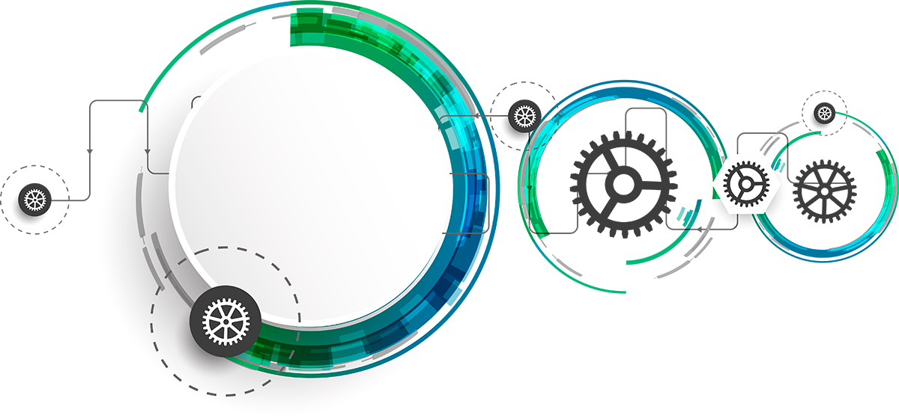
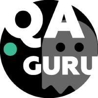
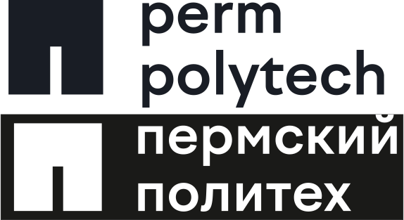
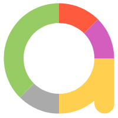
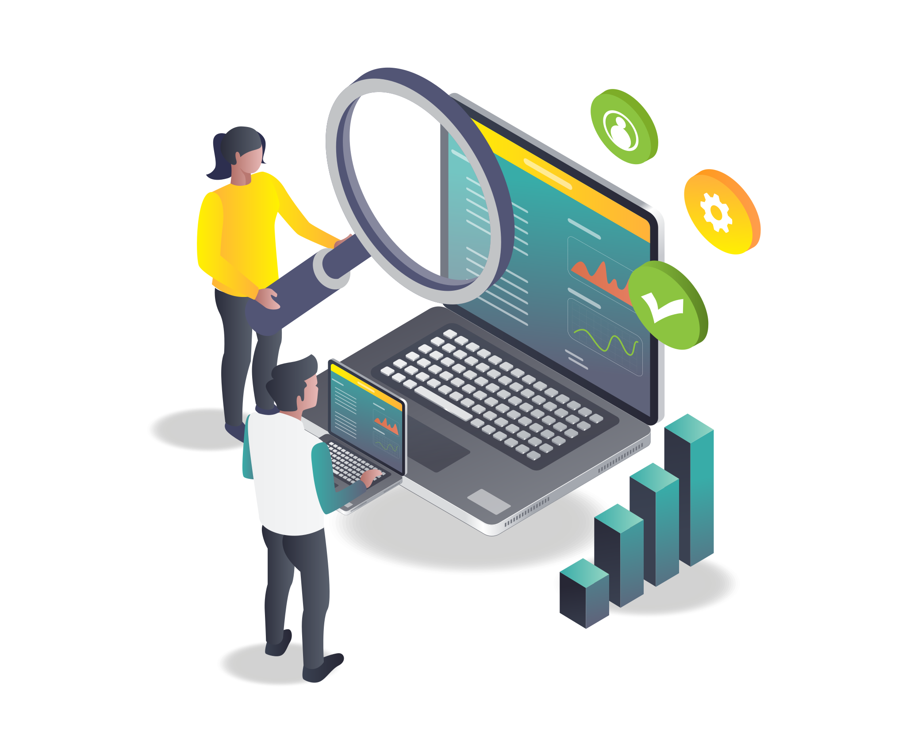

  
	<h1>Hello!    I'm  Alla</h1>
	<h2>QA Automation Engineer</h2>

### _I like automated testing and learning new things_
### _I think it is important to conduct quality testing of software_
	

<!-- Education section -->
## :books: My Education:

	
<h3> QA Automation</h3> 

	

		
 <h4>CERTIFICATE <i> OA Automation Engineer </i> </h4> 

		
	

	<table width="100%" border='0'>
		<tr>
			<td width="25%" align="center" valign="center">
				
			</td>
			<td valign="middle">Test Automation Engineering School <a target="_blank" href="https://qa.guru/en/">QA.GURU</a> 
			Школа инженеров по автоматизации тестирования <a target="_blank" href="https://qa.guru">QA.GURU</a> 
			</td>
		</tr>
	</table>

	
  <h3> Higher education  </h3> 

<table width="100%" border='0'>
    <tr>
        <td width="25%" align="center" valign="center">
            
            </td>
            <td valign="middle">TPERM NATIONAL RESEARCH POLYTECHNIC UNIVERSITY <a target="_blank" href="https://pstu.ru/en/">PTSU</a> 
		Information technology and automated systems  
		ПЕРМСКИЙ НАЦИОНАЛЬНЫЙ ИССЛЕДОВАТЕЛЬСКИЙ ПОЛИТЕХНИЧЕСКИЙ УНИВЕРСИТЕТ <a target="_blank" href="https://pstu.ru/">PTSU</a> 
		Информационные технологии и автоматизированные системы 
    	</td>
	</tr>
</table>

## :airplane: Using tecnologies and tools

</code>
<code></code>
<code></code>
<code></code>
<code></code>
<code></code>
<code></code>
<code></code>
<code></code>
<code></code>
<code></code>
<code></code>
<code></code>
<code></code>

## :earth_asia: My projects:
	
### :heavy_check_mark: UI Autotests

### :heavy_check_mark: API&Mobile Autotests 

### :heavy_check_mark: Mobile Autotests 

## :bar_chart: My Stats :

 

<!--
**FkkfRf/FkkfRf** is a ✨ _special_ ✨ repository because its `README.md` (this file) appears on your GitHub profile.

### Hello! I'm Alla. 

<code></code>

Here are some ideas to get you started:

- 🔭 I’m currently working on ...
- 🌱 I’m currently learning ...
- 👯 I’m looking to collaborate on ...
- 🤔 I’m looking for help with ...
- 💬 Ask me about ...
- 📫 How to reach me: ...
- 😄 Pronouns: ...
- ⚡ Fun fact: ...
-->
